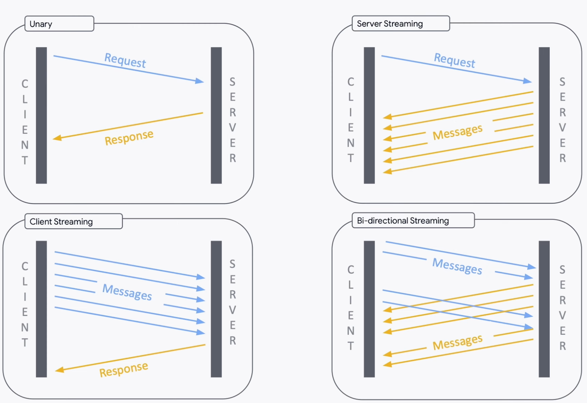
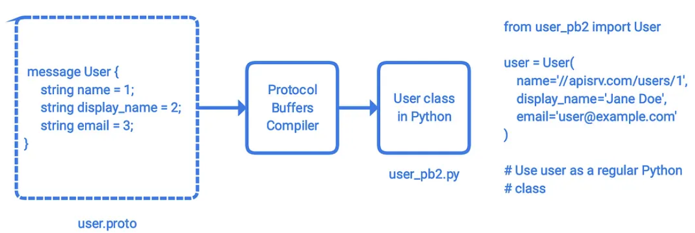
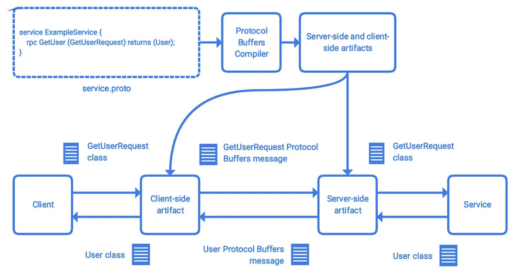
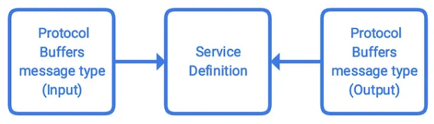

# gRPC (Google Remote Procedure Calls)

gRPC is an open-source RPC framework developed by Google. It uses HTTP/2 for transportation and offers many useful features such as bi-directional streaming and integrated authentication. APIs that use gRPC framework are gRPC APIs. It is recommended that gRPC APIs also adopt resource oriented design as architectural style.

Faster than JSON and high performace.

Good for communication between microservices and native mobile clients. 

Does not natively works with browsers --> we need to use extra GRPC gateway.

)

# Protocol Buffer

gRPC leverages `Protocol Buffer` to exchange data.

Similar to JSON and XML, is a Google-developed, open-source mechanism for data serialization.

The serialization process requires that you first specify the structure of your data in a `.proto` file using the Protocol Buffers language (`.proto` file syntax); this step is also known as defining a **Protocol Buffers message type**. 

Protocol Buffers compiler can then read the `.proto` file, and compile your data structure into a class in the language of your choice, which you may use to manipulate your data programmatically.




gRPC compile `.proto` files to server-side and client-side artifacts for gRPC API services, in additional to the data classes.

To use the plugin, you need to add service definitions to your .proto files, which describes your gRPC APIs. Each gRPC API takes one Protocol Buffers message type as input (request), and another Protocol Buffers message type as output (response).



|                                     | HTTP RESTful API       | gRPC API                               |
|-------------------------------------|------------------------|----------------------------------------|
| Architectural style                 | REST                   | Resource oriented design (recommended) |
| Resource representations            | usually JSON and XML   | usually Protocol Buffers messages      |
| Network protocol for transportation | usually HTTP/1.1       | HTTP/2                                 |
| Framework                           | Any HTTP web framework | gRPC                                   |

# Data Serialization

Data serialization is the process of converting an object into a stream of bytes to more easily save or transmit it.

# HTTP vs. gRPC API

The nature of HTTP/1.1 limits severely the performance of HTTP RESTful APIs: if you plan to stream some media contents, HTTP REST API is hardly a good choice.

gRPC APIs, on the other hand, performs much better than HTTP RESTful APIs in general and offers many additional features, such as streaming and extensible authentication (extensible via plugins). However, gRPC framework may not work in your target environment, and the platform running your API service might not support incoming gRPC connections.

If you choose to use gRPC for your project, with a little bit of extra effort you might be able to enjoy both the high performance of gRPC APIs and the compatibility of HTTP RESTful APIs --> [using gRCP gateway](https://github.com/grpc-ecosystem/grpc-gateway).

# Understading the code

Essentially, an API call to a method (endpoint) is nothing more than an `input (request)`, an `output (response)`, and some magic that associates the request with the response. Input offers all the parameters the method requires, and output is what the method returns.


In an gRPC API service, inputs (requests) and outputs (responses) are Protocol Buffers messages of specific types, defined in one or more `.proto` files using Protocol Buffers language. Service definitions in the `.proto` files associate the input message type with the output message type, and Protocol Buffers compiler compiles the `.proto` file(s) into code artifacts. You may then use these artifacts to build your API service and its client libraries.




## Resources and their fields

This gRPC API service features one resource: User.

The resource name of User is of the format `//myapiservice.com/users/USER-ID`. User features 3 fields:

| Field          | Type     | Data Type |
|----------------|----------|-----------|
| `name`         | Reserved | String    |
| `display_name` | Optional | String    |
| `email`        | Required | String    |


## Preparing the code

Protocol Buffers compiler can now prepare the server-end and the client-end artifacts (compiler generates data access classes --> these provide simple accessors for each field and methods in the `.proto` file):

```
python3 -m grpc_tools.protoc -I. --python_out=codegen/ --grpc_python_out=codegen/ example.proto
```

| Command/Argument              | Description                                                                                                |
|-------------------------------|------------------------------------------------------------------------------------------------------------|
| `python -m grpc_tools.protoc` | Start Protocol Buffers compiler in the gRPC package.                                                       |
| `-I.`                         | Input directory. The compiler will search this directory for imports. `.` (dot) implies current directory. |
| `--python_out=codegen/`       | Prepare Python classes for Protocol Buffers message types. Save the classes in the folder `codegen/`.      |
| `--grpc_python_out=codegen/`  | Prepare artifacts for the server and the client. Save the code in the folder `codegen/`.                   |
| `example.proto`               | Path to the .proto file.                                                                                   |


The compiler generates two files: `codegen/example_pb2.py` and `codegen/example_pb2_grpc.py`. `example_pb2.py` specifies how the message types in `example.proto` should look like in Python. `example_pb2_grpc.py` consists of two classes, `ExampleServiceServicer` and `ExampleServiceStub`, which you will use to build your own server-end and client-end code respectively.

gRPC will invoke the overridden `GetUser` method in the `ExampleServiceServicer` class automatically when a client accesses the `GetUser` endpoint. The framework automatically parses the `GetUserRequest` Protocol Buffers message into a `GetUserRequest` Python class, which you can manipulate idiomatically; it then takes a `User` Python class, serializes it into a `User` Protocol Buffers message, and return it to the client. Note that both `GetUserRequest` and `User` Python classes are defined in `example_pb2.py`.

The client will connect to the gRPC API service automatically when running. When customers invoke the `get_user` method with a `name` parameter, you will prepare it into a `GetUserRequest` Python class, and pass it to gRPC via the stub. gRPC then parses the `GetUserRequest` Python class into a `GetUserRequest` Protocol Buffers message, and send it to the server; the response from the server, a `User` Protocol Buffers message, is then parsed into a `User` Python class, and printed out.

If helpful, think of the `.proto` file as a contract between the server and its clients, gRPC the courier, and Protocol Buffers the arbitrator/translator. Protocol Buffers enforces the contract, and translates what clients and server speak from/into a universal language, with gRPC carrying the communications around in HTTP/2. gRPC + Protocol Buffers perform all the administrative tasks behind the scenes (transportation, serialization, etc.) so your server and clients can focus on what is truly important: the business logic of your app.